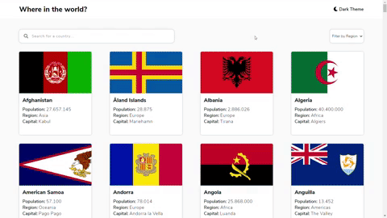
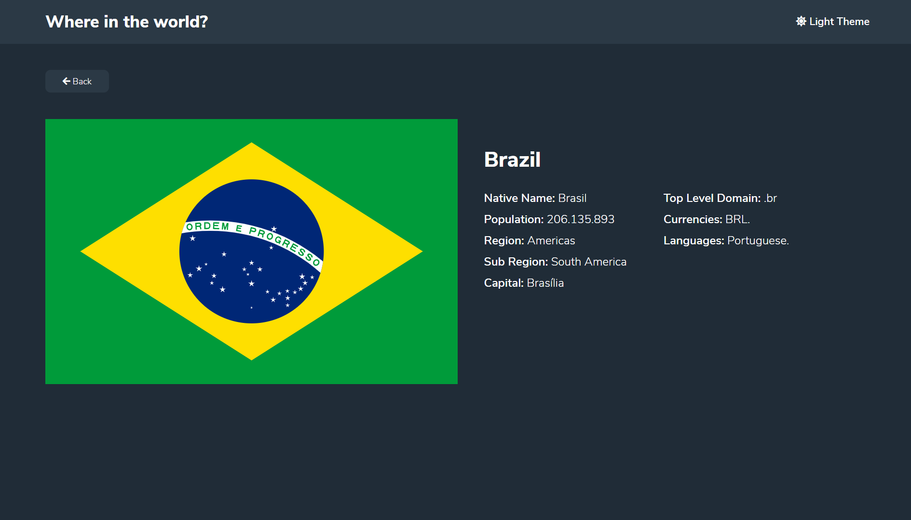
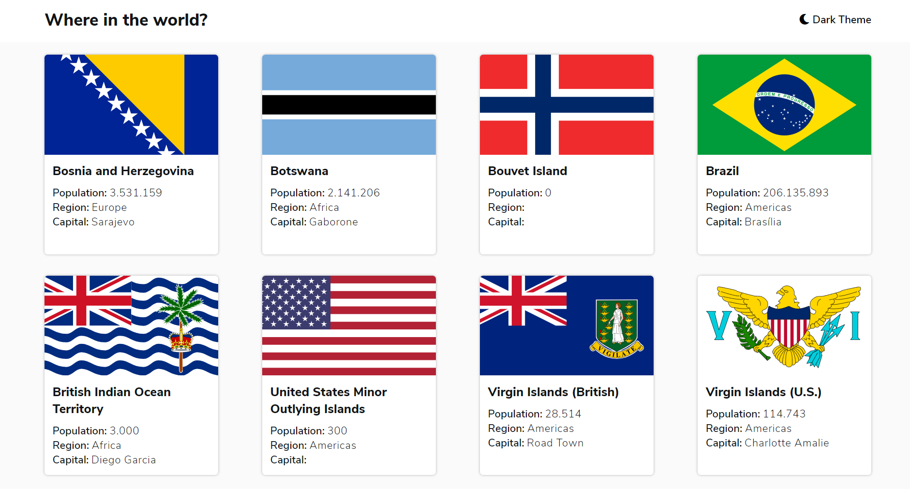
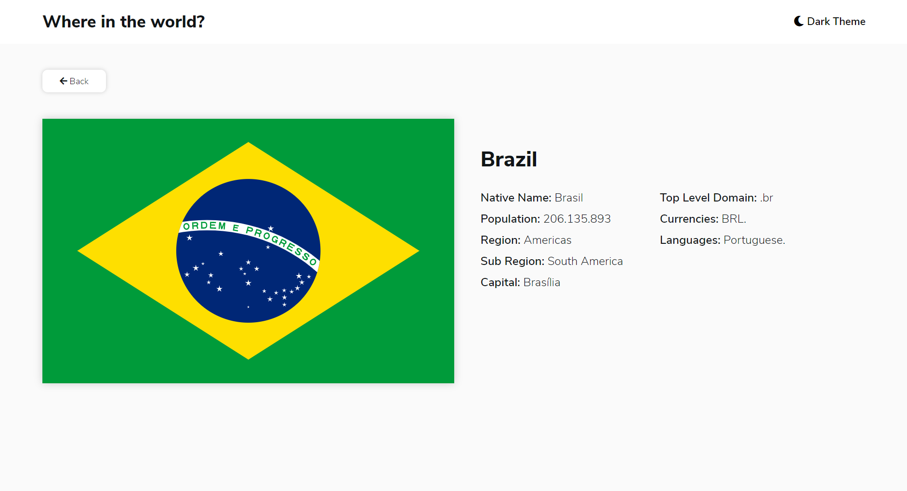

<h1 align="center">
  :earth_americas: Countries Web Application :earth_americas:
</h1>

<h4 align="center">
  A simple web application that uses the REST Countries API to display countries data, developed with Vue.js and Sass
</h4>

  
  

  <a href="#technologies">Used Technologies</a>&nbsp;&nbsp;&nbsp;|&nbsp;&nbsp;&nbsp;
  <a href="#objective">The project's goal</a>&nbsp;&nbsp;&nbsp;|&nbsp;&nbsp;&nbsp;
  <a href="#final-result">Final Result</a>

&nbsp;&nbsp;&nbsp;&nbsp;&nbsp;&nbsp;&nbsp;&nbsp;&nbsp;
&nbsp;&nbsp;&nbsp;&nbsp;&nbsp;&nbsp;&nbsp;&nbsp;&nbsp;
&nbsp;&nbsp;&nbsp;&nbsp;&nbsp;&nbsp;&nbsp;&nbsp;&nbsp;
&nbsp;&nbsp;&nbsp;&nbsp;&nbsp;&nbsp;&nbsp;&nbsp;&nbsp;
&nbsp;&nbsp;&nbsp;&nbsp;&nbsp;&nbsp;&nbsp;&nbsp;&nbsp;
&nbsp;&nbsp;&nbsp;&nbsp;

<h2 align="center">
  
</h2>

<h2 id="techonologies" name="technologies">
  :rocket: Used Technologies
</h2>

#### Front-end techs:
- [Vue.js](https://br.vuejs.org) to build all the front-end in general
- [Vuex](https://vuex.vuejs.org) to manage the state of the application
- [Sass](https://sass-lang.com/) to build the application styles
- [Sweet Alert](https://sweetalert.js.org/) to give the user friendlier alerts
- [Axios.js](https://github.com/axios/axios) to make the requests for the backend

<h2 id="objective" name="objective">
  :dart: Project's goal
</h2>

The aim of this project was practicing and fixing the concepts of Vue.js and Vuex(state manager for Vue.js apps) in my head, and also experience the process of the back-end and the front-end development in a project, I enjoyed building this app really much and I also loved the final result

<h2 id="final-result" name="final-result">
  :clipboard: Final Result
</h2>

### [You can check the app running here](https://countries-webapp.netlify.app)

### Screenshots

---

Hope you enjoyed this project :smiley: 
:wave: [Get in touch!](https://www.linkedin.com/in/tiagodiass)

### Author: [Tiago Dias](https://tiagodiass.github.io)
